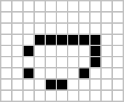
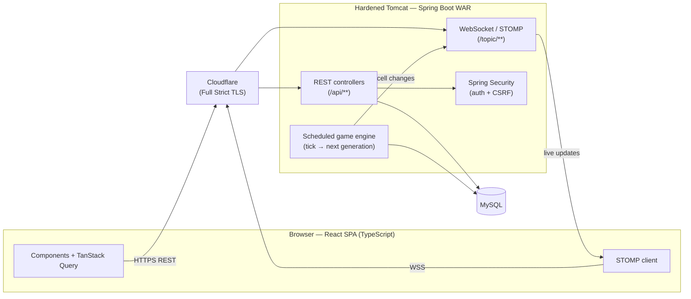

# GLM — Game Life Multiplayer

A multiplayer, real-time twist on Conway's Game of Life. Two players share one board, each owning their
own colour of living cells under custom two-player survival rules. A server-side engine advances the
simulation on a fixed tick and streams every cell change to all connected browsers over WebSocket/STOMP,
so everyone watches the same board evolve live. It is a full-stack Java portfolio project — Spring Boot 4
and React (TypeScript) packaged as a WAR for a hardened, externally-deployed Tomcat.



## Tech stack

| Layer | Technology |
|-------|-----------|
| Backend | Java 25, Spring Boot 4 — Web MVC, WebSocket/STOMP, Security, Data JPA; MapStruct DTO mappers |
| Frontend | React 19 + TypeScript, TanStack Query, React Router, Vite, i18next |
| Data | MySQL (production), H2 (development / tests) |
| Build | Maven — one command builds Java **and** the frontend (frontend-maven-plugin + Vite) |
| Deploy | WAR on a hardened external Tomcat (Chainguard image), Docker / docker-compose, TLS via Cloudflare Origin CA |
| Tests | JUnit 5, Mockito, MockMvc, Selenide (end-to-end) |

## Architecture



The browser fetches game state over REST (cached by TanStack Query) and subscribes to STOMP topics. The
scheduled engine computes each next generation, persists the cell changes, and publishes them to the STOMP
topics, which invalidate the client's query so the canvas redraws — no polling.

## Features

- Real-time multiplayer Game of Life with **per-player cell ownership** (two colours, custom survival rules)
- Server-side game engine on a scheduled tick; cell changes streamed live via WebSocket/STOMP
- Player authentication (Spring Security) with CSRF protection designed for the SPA
- Internationalised UI (i18next) and horizontal navigation menu / SPA routing
- Typed REST contract (DTOs via MapStruct) and RFC 7807 `ProblemDetail` error responses

## Quick start with Docker

The app runs on a hardened Chainguard Tomcat with TLS terminated at Tomcat using a Cloudflare Origin CA
certificate. You need Docker, a JDK 25 + Maven to build the WAR, and a `GLM_HOME` data folder.

```bash
# 1. Build the WAR (Java + minified React bundle)
mvn clean package

# 2. Point GLM_HOME at your data folder and deploy the WAR
export GLM_HOME=/home/user/docker/glm           # Windows: set GLM_HOME=d:\...\glm
cp target/ROOT.war "$GLM_HOME/tomcat/webapps/ROOT.war"

# 3. Start the hardened Tomcat container
docker compose up -d --build
```

`GLM_HOME/tomcat/` holds `webapps/` (drop `ROOT.war` here), `logs/`, and `tls/` (the Origin CA
`private_key.pem` + `orig_cer.pem`). The full deployment reference — TLS rotation, updating the app
without an image rebuild, JVM sizing — is documented in the header of [`docker-compose.yml`](docker-compose.yml).

To just build and run locally on the embedded Tomcat (no Docker, no external Tomcat):

```bash
mvn clean spring-boot:run -Pdev
```

## Running the tests

```bash
mvn test
```

The suite covers JUnit 5 unit tests (game logic, utilities), a MockMvc API error-handling test, and
**Selenide** end-to-end tests that drive a real browser (a Chrome/Chromium binary must be available). The
tests also run automatically as part of `mvn package`.

## Documentation

- **[CONTRIBUTING.md](CONTRIBUTING.md)** — all build variants (minified/unminified, frontend-only,
  Java-only), running locally, the Git branching model, and the dependency-upgrade procedure.

## Project status

Active portfolio project. Core gameplay, authentication, the real-time engine, the REST/WebSocket API, and
the deployment pipeline are in place; UI polish and additional features are ongoing.
